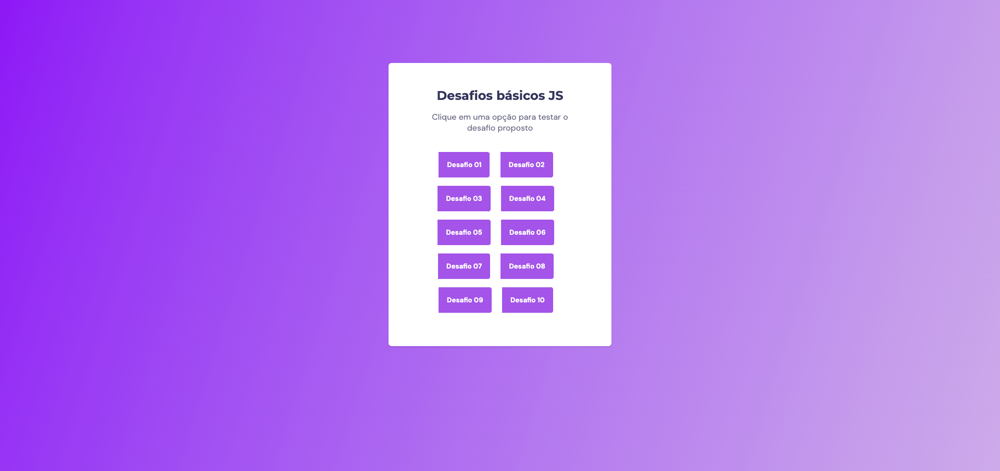

<h1 align="center"> Basic JS Challenges 👨🏻‍💻</h1>

 

## 💻 About this project

This project was provided by Rocketseat course that the goal is develop 10 challenges in JavaScript.

Demo link: https://basicjschallenges.netlify.app

## ⚡️ Techs

This project was developed using this following techs:

- HTML & CSS
- JavaScript
- Git & Github

  

This project was developed following the instructions from Rocketseat  :rocket: [Rocketseat community on Discord](https://discord.gg/rocketseat)
