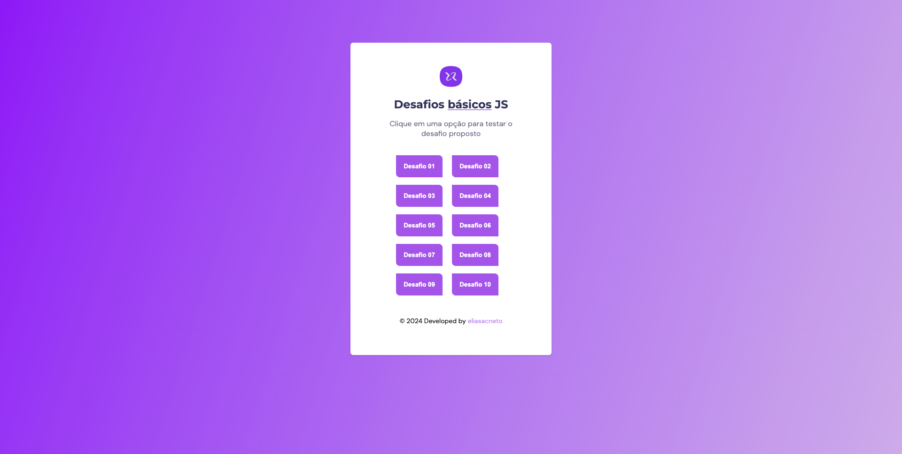

<h1 align="center"> Basic JS Challenges 👨🏻‍💻</h1>

 

## 💻 About this project

This project was provided by Rocketseat course that the goal is develop 10 challenges in JavaScript.

Demo link: https://basicjschallenges.netlify.app

  

## ⚡️ Challenges

01 - Create a script that displays the message "Hello World!" in a browser alert.

02 - Create a script that declares two variables and displays the result of the sum between them.

03 - Create a script that declares a variable and checks if its value is a number. If it is, display the message "It's a number", otherwise, display the message "It's not a number".

04 - Create a script that declares a variable and checks if its value is a string. If it is, display the message "It's a string", otherwise, display the message "It's not a string".

05 - Create a script that declares a variable and checks if its value is a boolean. If it is, display the message "It's a boolean", otherwise, display the message "It's not a boolean".

06 - Create a script that declares two variables and displays the result of the subtraction between them.

07 - Create a script that declares two variables and displays the result of multiplying them.

08 - Create a script that declares two variables and displays the result of the division between them.

09 - Create a script that declares a variable and checks if its value is an even number. If it is, display the message "It is an even number", otherwise, display the message "It is not an even number".

10- Create a script that declares a variable and checks if its value is an odd number. If it is, display the message "It is an odd number", otherwise, display the message "It is not an odd number".

This project was developed following the instructions from Rocketseat - :rocket: [Rocketseat community on Discord](https://discord.gg/rocketseat)
